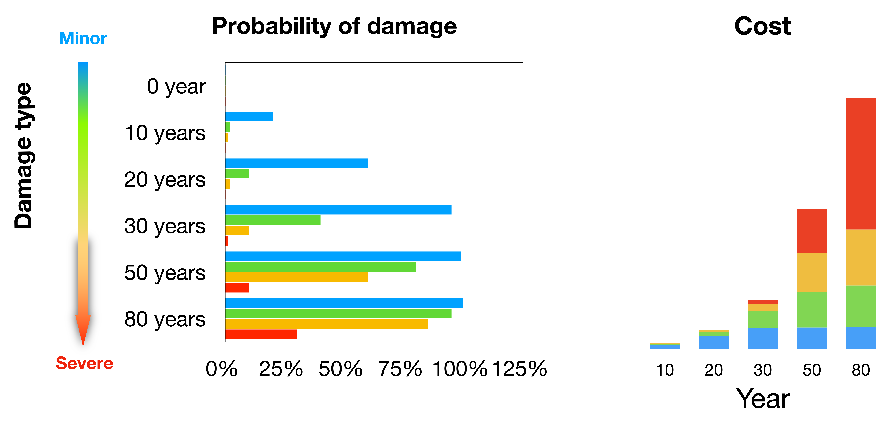
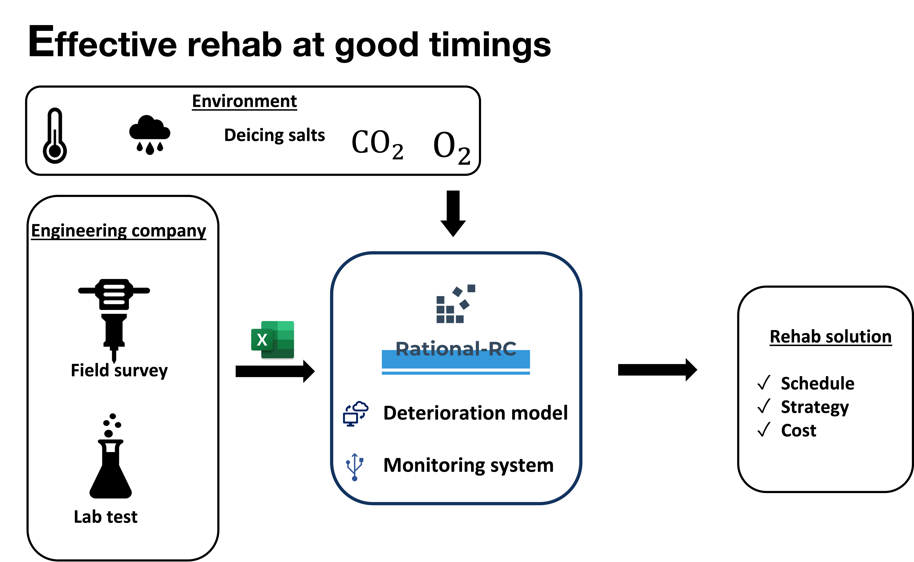

# Rehab bridge with confidence

## About Rational-RC
Rational-RC is a practical life cycle deterioration modelling framework. It utilizes the field survey data and provides probabilistic predictions of the RC structure deterioration through different stages of the service life cycle. It covers various deterioration mechanisms such as membrane deterioration, concrete carbonation and chloride penetration, corrosion and cracking.

## Full Service Life Cycle

One of the major components of modern infrastructure decay is due to the corrosion of embedded reinforcing steel in reinforced concrete (RC) structures. Prediction and early diagnosis of corrosion have become a very important task for engineers, repair practitioners, and owners of buildings and bridges. Traditional approach for estimating service life or repair benefit are based on judgmental methods borne of experience, which often produce a highly conservative estimate of service life which results in structures being replaced before it is necessary.  

Life cycle cost is reduced by taking preventive actions and avoiding unnecessary repairs. Additionally, it helps policymakers with regulating the evaluation criteria to choose optimal rehabilitation strategies for RC structures that may have exceeded their design lives but that do not necessarily need to be replaced. 

## Probabilistic Prediction with Confidence

### The limit-state probabilistic approach
The probabilistic approach concept of “load” and “resistance” used in the area of structural reliability is extended to different deterioration mechanisms. The probability of failure is defined as the probability when “load” exceeds the “resistance”.

### Modularized deterioration mechanism
The practical implementation of the complete model was broken into self-contained modules, with each module coping with a specific deterioration stage. The calculated probability of failure propagates into the next stage. 

## Integrated workflow
